# HDFS-Distributed-File-System
An individual project to simulate a Hadoop HDFS Distributed File System


## 实现目标

实现一个基于 Java CORBA 的 HDFS，包含一个 NameNode 和多个 DataNode，以及客户端程序。

## 项目背景

### HDFS

HDFS（Hadoop Distributed File System）是一个分布式文件系统，旨在解决大规模数据的存储和处理问题。它是 Apache Hadoop 项目的核心组件之一，为 Hadoop 提供了高可靠性、高吞吐量和高容错性等特性，广泛应用于大数据处理和分析场景中。
HDFS 的设计基于 Google File System（GFS）的思想，采用了 master/slave 架构。其中，NameNode 作为 master 节点，维护文件系统的命名空间、文件目录结构以及文件与块的映射关系；DataNode 作为 slave 节点，负责存储和管理实际的数据块。客户端通过与 NameNode 交互获取文件的元数据信息，然后与 DataNode 直接交互读写文件数据。

#### HDFS主要组件的功能

NameNode

* 存储元数据；
* 保存文件、block、datanode之间的映射关系。

DataNode

* 保存文件内容
* 文件内容保存在磁盘中
* 维护了blockid到datanode本地文件的映射关系。


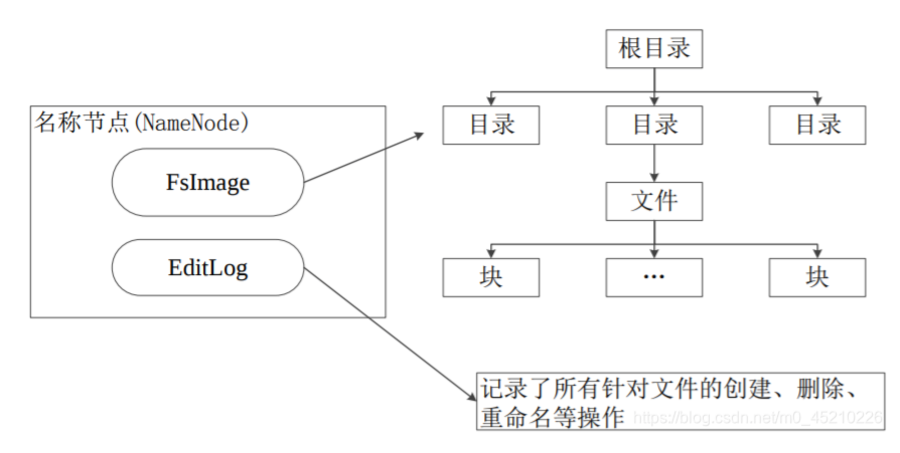

### Java CORBA

Java CORBA（Common Object Request Broker Architecture）是一种用于分布式计算的标准，它定义了一种机制，使得在不同的计算机和操作系统上运行的对象能够进行通信和交互。
CORBA 提供了一个中间件（Middleware）平台，用于协调和管理分布式系统中的对象之间的通信。它采用了面向对象的方法，允许不同的对象通过远程调用（Remote Method Invocation）的方式相互通信。这意味着对象可以像本地对象一样调用远程对象的方法，无论这些对象在分布式系统的哪个节点上。
以下是一些 Java CORBA 的关键概念：

1. 接口定义语言（Interface Definition Language，IDL）：IDL 是 CORBA 中用于定义接口的语言。它是一种中立的语言，可以独立于编程语言和硬件平台。通过使用 IDL，可以定义对象的接口和方法，以及它们的参数和返回值类型。
2. 对象请求代理（Object Request Broker，ORB）：ORB 是 CORBA 的核心组件，负责在分布式系统中协调和管理对象之间的通信。ORB 接收来自客户端的请求，并将其路由到适当的对象，然后将结果返回给客户端。同时，ORB 还提供了对象的生命周期管理和命名服务等功能。
3. Stub 和 Skeleton：客户端和服务器端分别使用 Stub 和 Skeleton 来实现远程调用。Stub 是客户端的代理对象，它隐藏了远程调用的细节，并提供了一个本地的接口，使得客户端可以像调用本地对象一样调用远程对象的方法。Skeleton 则是服务器端的代理对象，它负责接收来自客户端的请求并将其转发给真正的对象。
4. 命名服务（Naming Service）：CORBA 提供了一个命名服务，用于将对象的名称映射到其所在的地址。通过命名服务，客户端可以通过对象的名称来定位并访问远程对象。
   综上，Java CORBA 提供了一种方便的方式来构建分布式系统，使得不同的应用程序和组件可以通过网络进行通信。它具有跨平台和语言无关的特性，可以在不同的操作系统和编程语言之间进行交互。同时，Java CORBA 还提供了一些高级功能，如事务支持、安全性和持久化等。


## FsImage设计

FsImage是文件系统的命名空间和目录结构，用于维护文件系统树以及文件树中所有的文件和文件夹的元数据。这些元数据用inode的序列化形式表示。每个inode是一个文件或者目录的元数据的内部表示，包括文件大小、所在的DataNode以及文件划分的数据块信息等。

### 数据结构

在NameNode中，最关键的是目录树，设计结构如下：

```xml 
<?xml version="1.0" encoding="UTF-8"?>
<fsImage>
    <root>
        <id>1</id>
    </root>
    <inodes>
        <capacity>1000</capacity>
        <usedNum>6</usedNum>
    <inode>
        <id>1</id>
        <type>directory</type>
        <name>/</name>
        <size>0</size>
        <permission>3</permission>
        <ctime>2023-11-13 18:51:58</ctime>
        <mtime>2023-11-13 18:51:58</mtime>
        <atime>2023-11-13 18:51:58</atime>
        <children>
            <inode>
                <id>2</id>
                <type>file</type>
                <name>file1.txt</name>
                <permission>3</permission>
                <size>33369</size>
                <ctime>2023-11-15 16:56:56</ctime>
                <mtime>2023-11-16 16:23:06</mtime>
                <atime>2023-11-16 16:32:46</atime>
                <blocks>
                    <block>
                        <dataNodeNo>1</dataNodeNo>
                        <blockNo>2</blockNo>
                    </block>
                </blocks>
            </inode>
            <inode>
                <id>3</id>
                <type>directory</type>
                <name>dir1</name>
                <permission>3</permission>
                <ctime>2023-11-15 23:00:50</ctime>
                <mtime>2023-11-15 23:00:50</mtime>
                <atime>2023-11-15 23:00:50</atime>
                <children>
                    <inode>
                        <id>4</id>
                        <type>file</type>
                        <name>file1.txt</name>
                        <permission>3</permission>
                        <size>14</size>
                        <ctime>2023-11-15 22:55:30</ctime>
                        <mtime>2023-11-15 22:59:44</mtime>
                        <atime>2023-11-15 23:17:02</atime>
                        <blocks>
                        </blocks>
                    </inode>
                </children>
            </inode>
        </children>
    </inode>
</fsimage>
```

### 介绍

<b>唯一标志：文件/目录用inode表示，inode的id唯一标志一个inode。</b>

各部分信息如下：

* fsimage：根结点，表示fsimage;
* root：根inode节点（即根目录`/`，id表示其inode id。通过root寻找fsimage的根目录inode;
* indoes: 文件/目录的总体信息：
  * capacity: 该fsimage可存储的inode容量；
  * usedNum: 已创建的inode数量。
* inode：用于序列化文件/目录的存储方式。包含属性：
  * id：inode的id号，用于唯一标志一个inode;
  * type: 标志inode的类型。文件为`file`，目录为`directory`;
  * name: inode所表示的文件/目录名称，方便后续增加rename filename的扩展，因此不作为唯一标志。
  * permission：权限。`r`为`0b01`,`w`为`0b10`, `rw`为`0b11`，无读写权限为0;
  * size: 当inode表示文件的时候，用于表示文件大小；
  * ctime：创建时间；
  * mtime：修改时间（写模式下修改）；
  * atime：访问时间（读取模式下修改）；
  * blocks: 当inode为文件的时候，文件的实际数据存储在DataNode的Block中，blocks表示存储实际数据的block。
    * block：指示这些块的元信息：blockNo和dataNodeNo唯一标志block
      * dataNodeNo: block所在的dataNode的id；
      * blockNo: block所在的datanode下的block的id；
  * children：目录的子文件/子目录。


### 处理逻辑

具体的处理逻辑在`src/utils/FsImageParser.java`。

#### 初始化

如果namenode目录下不存在对应的fsimage，会按照fsimage模版初始化, 模版是 `lab1/Config/fsImage.xml`，包含fsimage的结构和根目录inode信息。
启动namenode的时候，会加载磁盘上的fsimage，读取当前inodes的信息，初始化inodeId.

#### 操作过程

在操作过程中，若访问一个尚未创建的文件夹/文件，将会自动创建。
close的时候更新到fsimage中。

### FsImageParser

解析fsimage文件，查找fsimage上对应的inode，创建inode，更新inode等。辅助NameNode处理。

```java
public static boolean isFilePathExist(String fsImagePath,String filePath);
public static Node findInodeByFilePath(String fsImagePath,String filePath, CommandTypeEnum commandTypeEnum);
public static Node parserPath(String fsImagePath,String filePath, boolean onlyExist,CommandTypeEnum commandTypeEnum);
public static Node findInodeByPath(Element element, String filePath, boolean onlyExist, CommandTypeEnum commandType);
public static Node findInodeByName(Element element, List<String> pathSegmentsList,int level, boolean onlyExist, CommandTypeEnum commandType);
public static Node findRootInode(Document doc);
public static void renewInodeElememt(FileDesc fileDesc,Element originInode);
//....
```


## DataNode的metaData设计

DataNode的block存储文件的实际数据，持久化存储在磁盘中。但是DataNode还需要持久化存储这些block的元数据，便于重启的时候加载到内存中。设计metaData如下：

### 数据结构

```xml
<datanode>
    <id>1</id>
    <capacity>100</capacity>
    <blockSize>4*1024</blockSize>
    <usedNum>2</usedNum>
    <usedBlocks>
        <block>
            <id>0</id>
        </block>
        <block>
            <id>1</id>
        </block>
    </usedBlocks>
</datanode>
```

### 介绍

各部分信息介绍如下：

* datanode：根节点，指示这是一个datanode的元数据信息。
* id：当前datanode的id；
* capacity：当前datanode的容量（可以存储block的最大数量，100表示最多可以存储100个block）;
* blockSize: block的存储容量，这里表示4KB;
* usedBlocks: 表示已经使用的blocks;
  * block: 块信息
    * id: 块id;
      datanode的id唯一标志DataNode, blockId和dataNodeId唯一标志block;

### 注册逻辑

1. NameNode上线。
2. 不同的DataNode用不同的datanodeId区分；DataNode上线后向NameNode注册，保存在NameNode的registeredDataNode列表中。

```java
//DataNodeLauncher.java
NameComponent[] path = ncRef.to_name("DataNode"+dataNodeServant.getId());
ncRef.rebind(path,href);

System.out.println("DataNode"+dataNodeServant.getId()+" is ready and start...");

NameNode nameNode = NameNodeHelper.narrow(ncRef.resolve_str("NameNode"));
System.out.println("Register to nameNode.");
nameNode.registerDataNode((int)dataNodeServant.getId());
```

3. 本项目暂不支持动态改变DataNode,所以client一上线即获取NameNode和已经向其注册过的DataNode.

```java
//ClientImpl.java

this.nameNode = NameNodeHelper.narrow(ncRef.resolve_str("NameNode"));
System.out.println("NameNode is obtained.");

boolean[] registeredDataNodes = nameNode.getRegisteredDataNodes();
for (int dataNodeId = 0; dataNodeId < Config.MAX_DATANODE_COUNT; dataNodeId++) {
    if(registeredDataNodes[dataNodeId]==true) {
        this.dataNodes[dataNodeId] = DataNodeHelper.narrow(ncRef.resolve_str("DataNode" + dataNodeId));
        System.out.println("DataNode" + dataNodeId + " is obtained.");
    }
}
```

## API限制/持久化要求

### API

```java
//api.idl
module api {
    typedef octet byteArray[4*1024];
    interface DataNode {
        byteArray read(in long block_id);
        void append(in long block_id, in byteArray bytes);
        long randomBlockId();
        long getUsedBlockNum();
        long getBlocksCapacity();
    };
    interface NameNode{
        string open(in string filepath, in long mode);
        void close(in string filepath);
        void registerDataNode(in long id);
        typedef sequence<boolean> BooleanSequence;
        BooleanSequence getRegisteredDataNodes();
    };
};
```

```java
ClientImpl.java
public int open(String filepath, int mode);
public void append(int fd, byte[] bytes);
public byte[] read(int fd);
public void close(int fd);
```

### 限制

经过对hdfs的资料搜集和pc本地文件系统的实践，open/read/append/close需要满足包括数据一致性等以下限制：

#### open

1. 创建文件的时候，无论读写模式，其他客户端都不能创建/读写文件；
2. 访问模式满足文件权限； 
3. 至多一个写者。
4. inode不会持久化到fsimage中。

#### close

1. close的时候需要将inode信息持久化到fsimgae中。
2. inode信息的更新逻辑：读写模式下的更新逻辑有所区别，关闭写者的时候更新文件大小和修改时间等，关闭读者的时候更新访问时间。
   * 注意读者的逻辑不要覆盖写者的逻辑。
   * 具体逻辑实现在`src/utils/FsImageParser.java/renewInodeElememt()`。

#### append

1. 满足写权限。
2. 数据一致性要求：
   * 写者append文件但未close之前，其他读者无法读取最新内容。只有写者close之后将数据持久化fsimage中，并且读者重新打开的时候才能读取到最新内容。 
   * dataNode的append接口一次只能写入一个block，写入即持久化到block中，并且更新到metaData中。
3. block的内存是设置为4KB, 不需要节约空间，因此一个block最多存储一个文件，即每个文件的开始都在某一个block的开始位置。
4. 写入内容无论是否超过块内存时，都需要在原来的末端位置开始写入。
5. 当写入内容超过的块内存的时候，需要重新选择datanode和block写入。policy如下：
   * 根据需要的block数量作为阈值，按datanode编号的顺序从可用的dataNode中选择datanode；
   * 从该datanode中未使用的block中按照blockid顺序选择可用的block；

#### read

1. 满足读权限。
2. 满足数据一致性要求(参考append)。
3. 读取最后一个block的时候注意缓冲区溢出的问题。

### 数据持久化需求

1. open：无论是否创建文件，都不持久化数据。
2. close：持久化存储数据到fsimage，注意写者和读者的顺序覆盖问题。
3. append：datanode每次append的时候，不仅将待append的数据持久化到block中，还将block的元数据也持久化到metaData中。
4. read：无需持久化。


## FileDesc

`src/utils/FileDesc.java`

### 数据结构

```java
public class FileDesc {
    /* the id should be assigned uniquely during the lifetime of NameNode,
     * so that NameNode can know which client's open has over at close
     * e.g., on nameNode1
     * client1 opened file "Hello.txt" with mode 'w' , and retrieved a FileDesc with 0x889
     * client2 tries opening the same file "Hello.txt" with mode 'w' , and since the 0x889 is not closed yet, the return
     * value of open() is null.
     * after a while client1 call close() with the FileDesc of id 0x889.
     * client2 tries again and get a new FileDesc with a new id 0x88a
     */
    @XmlElement
    final long id;
    @XmlElement
    private Inode inode;
    private int opMode; // to read/write in the fd
    private int writeRef; //0 or 1
    private int readRef;  // current read num;
    private String resultMessage;  //回复信息

    //....方法
}
```

* 用fd(id)来唯一标志一个fileDesc;
* 用Inode来表示文件的元数据。
* opMode表示该文件的访问模式。
* writeRef和readRef分别表示该文件描述符的读者数量和写者数量。
* resultMessage: 调用返回信息，表示成功/错误的情况。

### 通信

1. fileDesc在client和namenode的通信：通过fileDesc.toString()和fromString()对fileDesc序列化为xml格式的字符串进行API间的调用。 见`src/utils/FileDesc.java`.
2. 客户端采用设置`private FileDesc[] fdTable = new FileDesc[Config.MAX_CLIENT_FD_NUM+1]; //文件描述符从1开始`数组来存储打开的文件，为每个客户端独有，客户端fd选择policy为按顺序择空闲的fd：

```java
//ClientImpl.java
private int getEmptyFd(){
        for (int i = 1; i < fdTable.length; i++) {
            if(Objects.isNull(fdTable[i])) {
                return i;
            }
        }
        System.out.println(Config.respINFOPrefix() + "当前客户端已达到文件描述符数量, 操作失败");
        return 0;
    }
```

3. NameNode维护一个`private static Map<String, List<FileDesc>> FilePathAndFileDescMap;`缓冲区，防止客户端同时创建同一个文件，以及更新元数据信息到内存中。

## Inode

```java
@XmlRootElement
@XmlType(propOrder = {"id","type","name","size","permission","ctime","mtime","atime","blocks"})
public class Inode {
    private long id; //nodeId
    private String type;
    private String name;
    private long size;
    private int permission; // whether the file can read, can write
    private String ctime;
    private String mtime;
    private String atime;
    private List<Block> blocks;
    // method..
}
```

## Block

```java
@XmlRootElement
@XmlType(propOrder = {"dataNodeNo","blockNo"})
public class Block {
    private int dataNodeNo;
    private int blockNo;
    // method...
}
//    private
```

### 内存和持久化转换utils方法

考虑到内存和磁盘存储，针对Inode、Block、FileDesc分别创建对应的和`org.w3c.dom.Element`相互转换的方法。具体逻辑见代码。

```java
//Block.java
public static List<Block> nodes2Blocks(Element element);
public Block(Element blockNode);
public static Element createBlockElement(Block block);

//Inode.java
public Inode(Element element);
public static Element createInodeElement(Inode inode);

//FileDesc.java
public FileDesc(long id, Element element, int opMode);
```


## 命令行

### 封装&&处理逻辑

输入命令用scanner.nextLine()捕捉。
将客户端的输入封装为一个命令类`Command`。
同时将open/append/read/close等操作方式封装成`CommandTypeEnums`类.
将r/w/rw等读写模式封装成`CommandModeEnums`类.
为了增加客户端程序的鲁棒性，对命令行的各种情况进行了分析，确保错误的命令也能持续运行程序。
在Command类中完成对命令行的参数的解析,考虑到这几个命令最多需要三个参数（append需要将fd后面所有的参数整合为一个），<b>通过新增额外的一个参数返回参数的校验情况（成功/错误信息）。</b>

```java
//ClientLauncher.java
if(!args[3].equals("OK")){ //命令有误 
    System.out.println(Config.respINFOPrefix()+args[3]);//args[3]存储错误情况信息。
} else { // 命令正确
 //处理逻辑
} 
```

```java
//Command.java
public static Command addressRawCommand(); //处理用户输入的命令，返回处理后的Command;
public static String[] checkArgs(String commandArgs[]); //判断参数的检验函数并修改为default，返回错误信息；确保能正常调用接口。
```

### 效果

可以支持各种错误情况并返回错误原因：
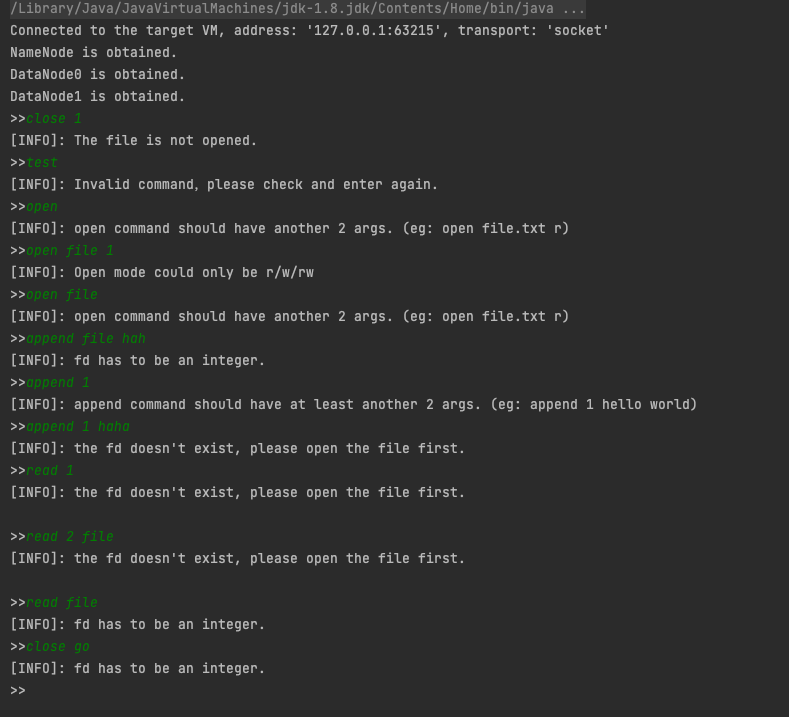


## 扩展

多线程动态更新DataNode等。


## junit测试

### namenode

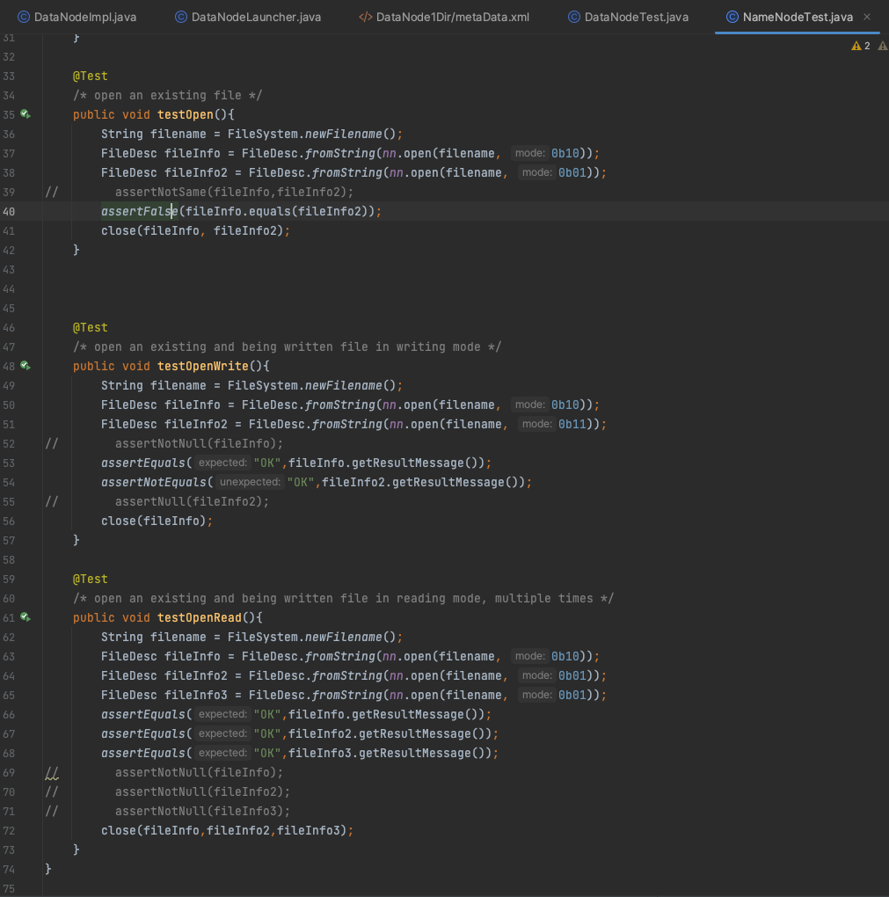

### datanode

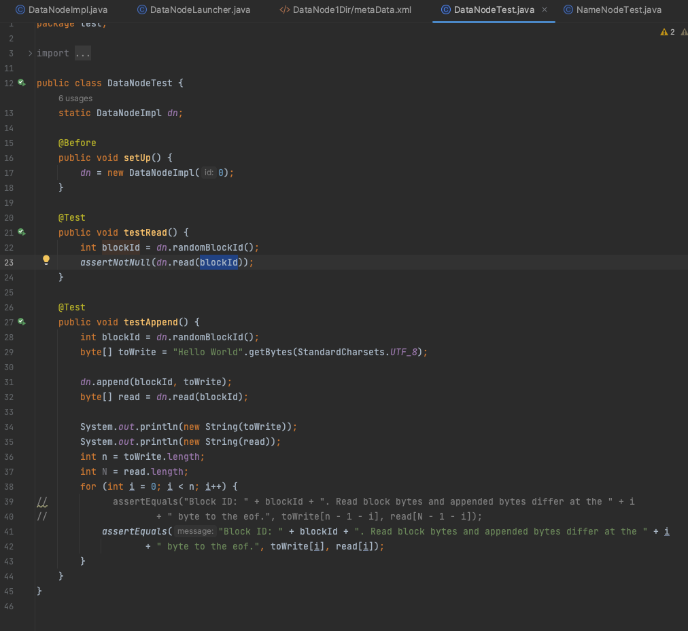

### client

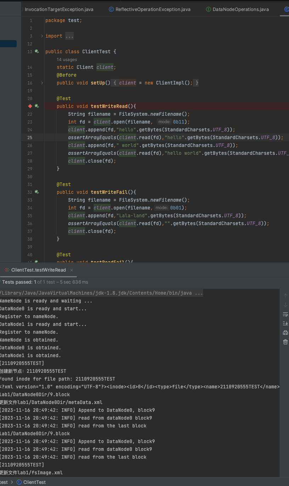

## 手动测试

启动顺序：
namenode——>多个datanode——>多个client

### namenode

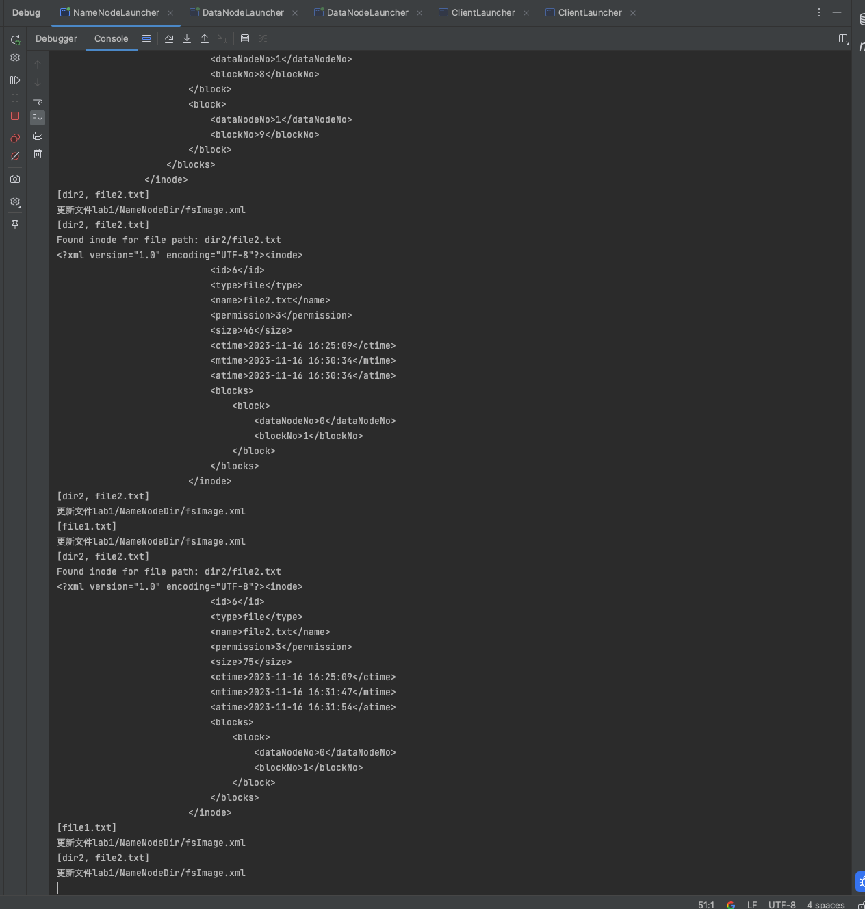

### datanode

#### dn1

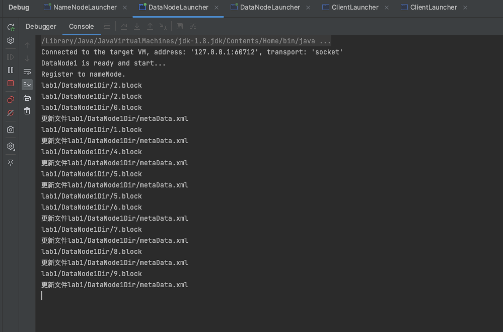

#### dn2

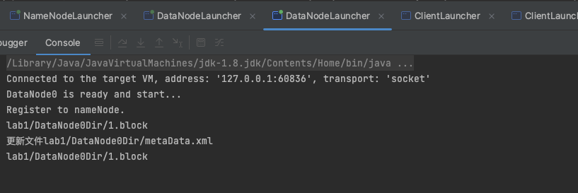

### client

消息设置了时间，方便清楚看到不同模式下的访问权限等。

#### client1

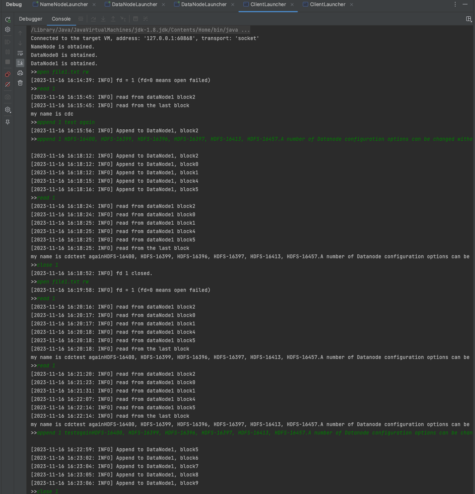
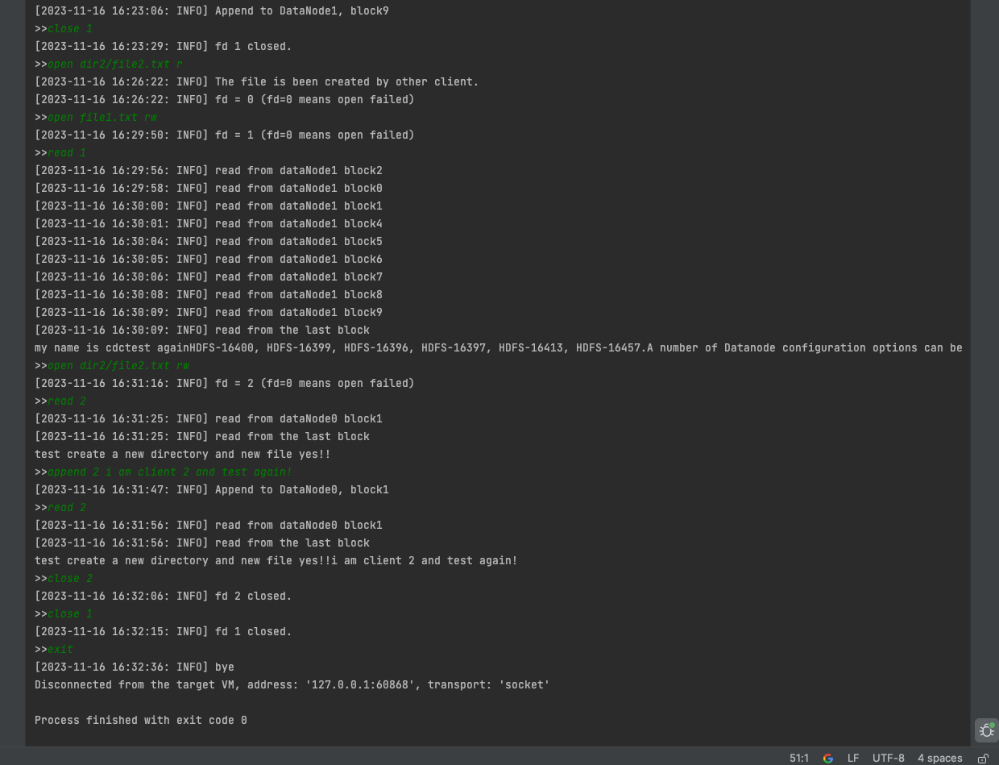

#### client2

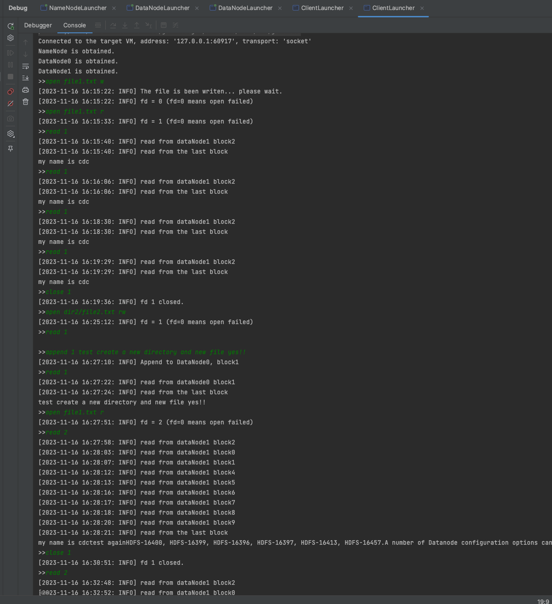
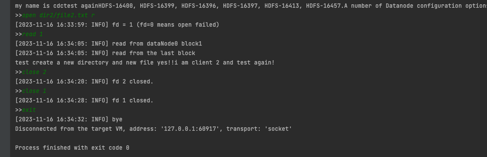


## 参考资料

[分布式文件系统HDFS笔记](https://blog.csdn.net/m0_45210226/article/details/105422303
)


## 项目结构

Attention： 
手动测试/正常运行时，datanode和namenode等目录都在DistributedSystemLab1/lab1下。
junit测试：在lab1/src/lab1下。

lab1
├── Config   //模版配置目录
│   ├── fsImage.xml
│   └── metaData.xml
├── DataNode0Dir  //dataNode目录
│   ├── 0.block
│   └── metaData.xml
├── DataNode1Dir //dataNode目录
│   ├── 0.block
│   ├── 1.block
│   ├── 2.block
│   └── metaData.xml
├── DistriLab1.iml
├── NameNodeDir //nameNode目录
│   └── fsImage.xml
├── images
├── java-chat-corba
├── lib
├── orb.db
├── src   //项目根目录
│   ├── Main.java
│   ├── api
│   │   ├── Client.java
│   │   ├── DataNode.java
│   │   ├── NameNode.java
│   ├── api.idl
│   ├── bin
│   ├── enums
│   │   ├── CommandModeEnum.java
│   │   └── CommandTypeEnum.java
│   ├── impl
│   │   ├── ClientImpl.java
│   │   ├── DataNodeImpl.java
│   │   └── NameNodeImpl.java
│   ├── lab1  //这一个是test的时候因为文件路径的问题，test的时候产生的fsimage/block都在这个目录下
│   │   ├── Config
│   │   │   ├── fsImage.xml
│   │   │   └── metaData.xml
│   │   ├── DataNode0Dir
│   │   ├── DataNode1Dir
│   │   └── NameNodeDir
│   │       └── fsImage.xml
│   ├── lab1.iml
│   ├── launcher
│   │   ├── ClientLauncher.java
│   │   ├── DataNodeLauncher.java
│   │   └── NameNodeLauncher.java
│   ├── orb.db
│   │   ├── NC0
│   │   ├── counter
│   │   ├── logs
│   │   └── servers.db
│   ├── test
│   │   ├── ClientTest.java
│   │   ├── DataNodeTest.java
│   │   └── NameNodeTest.java
│   └── utils
│       ├── Block.java
│       ├── Command.java
│       ├── Config.java   //基本配置类
│       ├── FileDesc.java
│       ├── FileSystem.java
│       ├── FsImageParser.java
│       └── Inode.java
└── 实验报告.md
