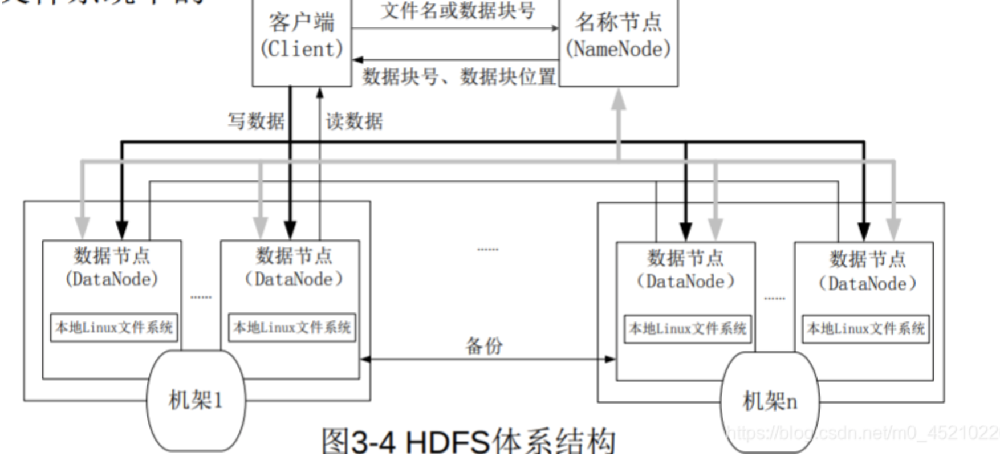
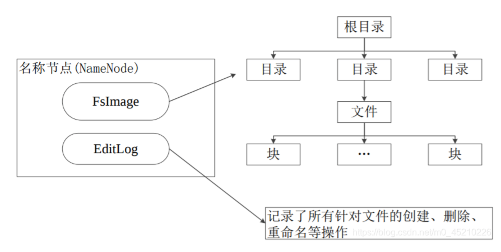

# 实验报告 陈丹纯 20307130350

## HDFS主要组件的功能
NameNode
* 存储元数据；
* 元数据保存在内存中；
* 保存文件、block、datanode之间的映射关系。

DataNode
* 保存文件内容
* 文件内容保存在磁盘中
* 维护了blockid到datanode本地文件的映射关系。

## FsImage设计
FsImage是文件系统的命名空间和目录结构，用于维护文件系统树以及文件树中所有的文件和文件夹的元数据。这些元数据用inode的序列化形式表示。每个inode是一个文件或者目录的元数据的内部表示，包括文件大小、所在的DataNode以及文件划分的数据块信息等。

在NameNode中，最关键的是目录树，结构如下：

```xml 
<fsimage>
  <inode>
    <id>1</id>
    <type>directory</type>
    <name>/</name>
    <permission>755</permission>
    <modificationTime>1626240000000</modificationTime>
    <accessTime>0</accessTime>
    <children>
      <inode>
        <id>2</id>
        <type>directory</type>
        <name>dir1</name>
        <permission>755</permission>
        <modificationTime>1626240000000</modificationTime>
        <accessTime>0</accessTime>
        <children>
          <inode>
            <id>3</id>
            <type>file</type>
            <name>file1.txt</name>
            <permission>644</permission>
            <size>1024</size>
            <modificationTime>1626240000000</modificationTime>
            <accessTime>1626240000000</accessTime>
          </inode>
          <inode>
            <id>4</id>
            <type>file</type>
            <name>file2.txt</name>
            <permission>644</permission>
            <size>2048</size>
            <modificationTime>1626240000000</modificationTime>
            <accessTime>1626240000000</accessTime>
          </inode>
        </children>
      </inode>
      <inode>
        <id>5</id>
        <type>directory</type>
        <name>dir2</name>
        <permission>755</permission>
        <modificationTime>1626240000000</modificationTime>
        <accessTime>0</accessTime>
        <children>
          <inode>
            <id>6</id>
            <type>file</type>
            <name>file3.txt</name>
            <permission>644</permission>
            <size>3072</size>
            <modificationTime>1626240000000</modificationTime>
            <accessTime>1626240000000</accessTime>
          </inode>
        </children>
      </inode>
    </children>
  </inode>
</fsimage>

```

各部分信息如下：
fsimage下

file：文件节点，其属性name中存储文件名，其内容为元信息所在文件
folder：文件夹节点，其属性name中存储文件夹名称，其内部可以嵌套其他文件夹或文件
在操作过程中，若访问一个尚未创建的文件夹/文件，将会自动创建





### 参考资料
[分布式文件系统HDFS笔记](https://blog.csdn.net/m0_45210226/article/details/105422303
)
